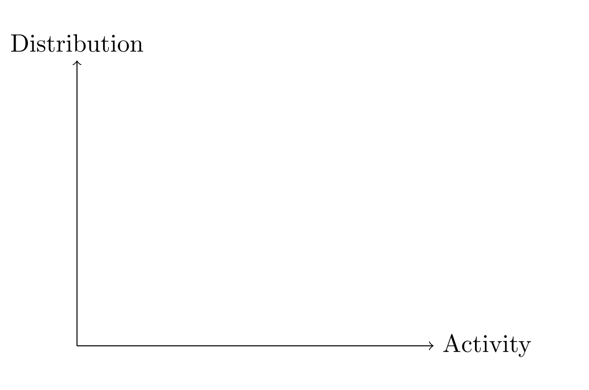

```{r Setup, include = F}
options(htmltools.dir.version = FALSE)
library(pacman)
p_load(broom, latex2exp, ggplot2, ggthemes, ggforce, viridis, dplyr, magrittr, knitr, parallel, xaringanExtra,
       tidyverse, sjPlot, extrafont, mathjaxr, ggforce, furrr, kable, kableExtra,
       fontawesome, ggthemr, hrbrthemes)


# Knitr options
opts_chunk$set(
  comment = "#>",
  fig.align = "center",
  fig.height = 7,
  fig.width = 10.5,
  warning = F,
  message = F,
  dpi=300
)


theme_ms <- function() {
  theme_minimal(base_family = "IBM Plex Sans") +
    theme(panel.grid.minor = element_blank(),
          plot.background = element_rect(fill = "white", color = NA),
          plot.title = element_text(face = "bold"),
          strip.text = element_text(face = "bold"),
          strip.background = element_rect(fill = "grey80", color = NA),
          #axis.title.x = element_text(hjust = 0),
          #axis.title.y = element_text(hjust = 1),
          legend.title = element_text(face = "bold"))
}

theme_set(theme_ms())


```

```{R, colors, include = F}
# Define pink color
red_pink <- "#e64173"
turquoise <- "#20B2AA"
orange <- "#FFA500"
red <- "#E02C05"
blue <- "#2b59c3"
green <- "#0FDA6D"
grey_light <- "grey70"
grey_mid <- "grey50"
grey_dark <- "grey20"
purple <- "#6A5ACD"
met_slate <- "#23373b" 
```


```{r, echo=FALSE}
knitr::read_chunk('correlations-extended.R')

```

```{r, echo=FALSE}
<<prework>>

```

```{r, echo=FALSE}
<<load_data>>

```

```{r, echo=FALSE}
<<dots>>

```

```{r, echo=FALSE}
<<scatters>>

```


class: middle, center, inverse


.b[Marcio Santetti, Ph.D.]

<br>

.b[Economics Department]

.b[Skidmore College]


[`r fontawesome::fa("envelope")` msantetti@skidmore.edu](msantetti@skidmore.edu) <br>
[`r fontawesome::fa("link")` marcio.rbind.io](https://marcio.rbind.io) <br>
[`r fontawesome::fa("github")` github.com/marciosantetti](https://github.com/marciosantetti) 

---

# Presentation outline

<br>

1. Introduction/Motivation

2. Related literature

3. Data & empirics

4. Results

5. Conclusions


---
layout: false
class: inverse, middle

# Introduction

---

# Motivation

<br><br><br><br>

$$
\begin{aligned}
\text{Aggregate Income} = \text{Wages} + \text{Profits} + \text{Interest} + \text{Rents} + \text{Capital Depreciation}
\end{aligned}
$$


---

# The stylized fact I


```{r, echo = F, dev = "svg", fig.height = 5.75}
#---- Prep:

dat <- read_csv("data.csv")


dat <- dat %>% 
  mutate(period = seq(as.Date("1947-01-01"), by = "quarter", length.out = 304))


dat_yr <- dat |> 
  mutate(yr = floor_date(period, unit = "year")) |> 
  group_by(yr) |> 
  reframe(avg_psi = mean(psi),
            avg_psigr = mean(psigr),
            yr = year(yr))


p1 <- dat_yr |> 
  ggplot(aes(x = yr, y = avg_psi)) +
  geom_line(linewidth = .6, color = met_slate) +
  labs(x = "",
       y = "Index 2017=100",
       title = "U.S. labor (wage) share of income: 1947–2022",
       subtitle = "Bureau of Labor Statistics’ (BLS) “headline measure”",
       caption = "Source: U.S. Bureau of Labor Statistics.") +
  scale_x_continuous(breaks = c(1950, 1960, 1970, 1980, 1990, 2000, 2010, 2020)) +
  geom_vline(xintercept = 1980,
             linetype = 3)
  

p2 <- dat_yr |> 
  ggplot(aes(x = yr, y = avg_psigr)) +
  geom_line(linewidth = .6, color = blue) +
  labs(x = "",
       y = "%",
       title = "U.S. labor (wage) share of income: 1947–2022",
       subtitle = "Share of total compensation",
       caption = "Source: U.S. Bureau of Economic Analysis.") +
  scale_x_continuous(breaks = c(1950, 1960, 1970, 1980, 1990, 2000, 2010, 2020)) +
  geom_vline(xintercept = 1980,
             linetype = 3)

p2 + geom_point(color = blue)

```

---

# The stylized fact I

```{r, echo = F, dev = "svg", fig.height = 5.75}

p2 + geom_point(color = blue) +
  geom_smooth(method = "lm", se=FALSE, color = turquoise, linetype = 2)

```

---

# The stylized fact II

```{r, echo = F, dev = "svg", fig.height = 5.75}

p1 + geom_point(color = met_slate)

```

---

# The stylized fact II

```{r, echo = F, dev = "svg", fig.height = 5.75}

p1 + geom_point(color = met_slate) +
  geom_smooth(method = "lm", se=FALSE, color = turquoise, linetype = 2)

```


---

# A theoretical reference

.pull-left[

[`Goodwin (1967)`](https://link.springer.com/chapter/10.1007/978-1-349-05504-3_12):

  - A model of the .hi[growth/distributive] cycle;
  
  - A never-ending .hi-red[conflict]/.hi[symbiosis] between capital and labor.

]

.pull-right[


]

---


# Into a picture...

<br>

.center[

]

---

# Into a picture...

<br>

.center[

]


---

# The "Goodwin pattern"

<br>

.center[

]


---

# What does reality say?

--

.hi-grey[Gray] triangles: cycles's .hi-grey[*first*] quarter; .b[Black] triangles: cycle's .b[*last*] quarter.

```{r, dev = "svg", echo = F, fig.height = 5, fig.width=10}
<<scatter1>>

```

---

# What does reality say?

.hi-grey[Gray] triangles: cycles's *first* quarter; .b[Black] triangles: cycle's *last* quarter.

```{r, dev = "svg", echo = F, fig.height = 5, fig.width=10}
<<scatter2>>

```

---

# What does reality say?

.hi-grey[Gray] triangles: cycles's *first* quarter; .b[Black] triangles: cycle's *last* quarter.

```{r, dev = "svg", echo = F, fig.height = 5, fig.width=10}
<<scatter3>>

```


---

# Contribution(s)

<br>

A few .hi-red[limitations] of [`Goodwin's (1967)`](https://link.springer.com/chapter/10.1007/978-1-349-05504-3_12) original story:

<br>

--

  - What .hi[triggers] a new business cycle?
  
--
  
  - What .hi-slate[stops] a recovery process?
  
--
  
  - How can this real sector analysis be combined with the .hi[financial] side?

---
layout: false
class: inverse, middle

# Related literature

---

# Related literature

.pull-left[.hi[(1) Demand & distributive regimes:]

  - What is the .hi[mechanism] behind this pattern?]
  
--

.pull-right[
```{r, dev = "svg", echo = F, fig.height = 7.5, fig.width=8}
<<scatter_unique>>

```
]


---

# Related literature

.pull-left[.hi[(1) Demand & distributive regimes:]

  - What is the .hi[mechanism] behind this pattern?
  - .hi-red[Profit-led demand] & .hi-slate[profit-squeeze distribution]]
  


.pull-right[
```{r, dev = "svg", echo = F, fig.height = 7.5, fig.width=8}
<<scatter_unique>>

```
]


---

# Related literature

.pull-left[.hi[(1) Demand & distributive regimes:]

  - What is the .hi[mechanism] behind this pattern?
  - .hi-red[Profit-led demand] & .hi-slate[profit-squeeze distribution]
    - [`Barrales et al. (2022)`](https://onlinelibrary.wiley.com/doi/abs/10.1111/joes.12432)
    - [`Santetti et al. (2023)`](https://www.sciencedirect.com/science/article/abs/pii/S0954349X23001856)]
  

--

.pull-right[

.hi-red[However], have these regimes *weakened*?

  - [`Goldstein (1999)`](https://onlinelibrary.wiley.com/doi/abs/10.1111/1467-999X.00066)
  - [`Setterfield (2023)`](https://www.tandfonline.com/doi/full/10.1080/09538259.2021.1921357?casa_token=I72GQj_JGLIAAAAA%3AQZkfEqywOPFq2iCiiApLKL3VaD8SWvPwQp-_5f-vWxZ_qN3bpFKVDLN_MP2IpH1qAr5UcCjocXwm)
  - [`Carrillo-Maldonando & Nikiforos (2024)`](https://www.sciencedirect.com/science/article/pii/S0954349X23001431)

]

---

# Related literature

.pull-left[.hi[(1) Demand & distributive regimes:]

  - What is the .hi[mechanism] behind this pattern?
  - .hi-red[Profit-led demand] & .hi-slate[profit-squeeze distribution]
  - .hi-red[However], have these regimes *weakened*?]
    
  

--

.pull-right[.hi[(2) Financial connections:]
  
  - *Residential investment* .hi[leads] the business cycle
  
    - [`Davis & Heathcote (2005)`](https://onlinelibrary.wiley.com/doi/abs/10.1111/j.1468-2354.2005.00345.x)
    - [`Barbosa-Filho et al. (2008)`](https://www.tandfonline.com/doi/abs/10.2753/PKE0160-3477300407?casa_token=dmgrMd6Tiy4AAAAA:vs1jDNBNpt_0RGN_hVnpDPOHQ62Z_Uue3Ad8SU8My8RJQVoPwEIfrUj5a2jsr0ebiSIc594qUXi4)
    - [`Fiebiger (2018)`](https://academic.oup.com/cje/article-abstract/42/1/155/3737556?redirectedFrom=PDF&casa_token=d7w-IxrB8fgAAAAA:RZ2uAVvRP1bnTid4k8cxLY0EjyEyHbGIROeQ4fODW90HqJM-VKA_q-kdykgrvMgxZWjMJrDuxGQWPw)
    
  - Role of *financial institutions*
  
    - [`Foley (1987)`](https://www.sciencedirect.com/science/article/abs/pii/0167268187900503)
    - [`Taylor (2012)`](https://onlinelibrary.wiley.com/doi/abs/10.1111/j.1467-999X.2010.04117.x)
    - [`Adrian & Shin (2010)`](https://www.sciencedirect.com/science/article/abs/pii/B9780444532381000120)
    - [`Stockhammer & Michell (2017)`](https://academic.oup.com/cje/article-abstract/41/1/105/2625385)


]

---

# Related literature

.pull-left[.hi[(1) Demand & distributive regimes:]

  - What is the .hi[mechanism] behind this pattern?
  - .hi-red[Profit-led demand] & .hi-slate[profit-squeeze distribution]
  - .hi-red[However], have these regimes *weakened*?]
    

.pull-right[.hi[(2) Financial connections:]
  
  - *Residential investment* .hi[leads] the business cycle
  - Role of *financial institutions*
]


.pull-left[
.hi[(3) Empirics:]
  
  - Standard econometric models  (e.g., *VAR*)
  - A .hi-red[unique] set of parameters
  - How to account for .hi-slate[continuous] changes?
    - [`Carrillo-Maldonando & Nikiforos (2024)`](https://www.sciencedirect.com/science/article/pii/S0954349X23001431)
]


--

.pull-right[
.hi[Here], a comprehensive model

  - .hi-slate[Real-financial] connections;
  - A .hi-slate[time-varying] econometric methodology;
  - Have these regimes .hi-slate[actually] weakened?
]

---
layout: false
class: inverse, middle

# Data & empirics

---

# Data & empirics

.hi[Four] system variables:

  - Labor share of income (*&psi;*);
  - Employment rate (*e*);
  - Residential investment (*g*);
  - Interest rate spread (*s*).

---

# Data & empirics

.hi[Four] system variables:

  - .b[Labor share of income] (*&psi;*)
    - Source: U.S. Bureau of Economic Analysis (BEA).
    - Ratio between total *compensation* (including public employment) and the sum of the latter and net *interest*, *rental* income, corporate *profits*, and capital *depreciation.*
    
<br>

  - .b[Employment rate] (*e*)
    - Source: U.S. Bureau of Labor Statistics (BLS).
    - Remainder to 100 of the civilian unemployment rate (%).

---


# Data & empirics

.hi[Four] system variables:

  - .b[Residential investment] (*g*)
    - Source: BEA's National Income and Product Accounts (NIPA), Table 1.1.3.
    - Index (2012=100).
  
<br>

  - .b[Interest rate spread] (*s*)
    - Source: U.S. Federal Reserve (Fed) System.
    - Difference between the market yield on U.S. Treasury securities at **10-year** maturity rate and the **3-month** Treasury bills secondary market rate.


--


- .b[Sample period]: 1953Q2&mdash;2022Q4.
- .b[Hamilton filter] applied to all variables.

---

# Hamilton filter in action

```{r, echo = F}
<<ham>>

```

```{r, dev = "svg", echo = F, fig.height = 5.5, fig.width=10.5}
<<hamfig>>

```


---

# Data & empirics

.pull-left[

A .hi[Vector Autoregressive] (VAR) model with .hi-slate[time-varying] parameters and .hi-red[stochastic volatility]:

<br>

$$
\begin{aligned}
\mathbf{y}_t = X_t\beta_t + A^{-1}_t\Sigma_t\varepsilon_t
\end{aligned}
$$

<br>

where $\mathbf{y}_t = (\psi_t, e_t, g_t, s_t)'$ is a row vector of endogenous variables.

The key estimates are contained in $\varepsilon_t$, the vector of .b[macroeconomic shocks] (residuals).
]

--

.pull-right[
- .hi-slate[Ordering] matters!


A .hi[recursive] identification:

$$
\begin{aligned}
\psi_t \rightarrow e_t \rightarrow g_t \rightarrow s_t
\end{aligned}
$$


<br>

In words:

  - Finance (*s*) .hi[*leads*] (i.e., precedes) residential investment (*g*);
  - Residential investment (*g*) .hi[*leads*] employment (*e*);
  - Employment (*e*) .hi[*leads*] the labor share (*&psi;*).


]


---

# Data & empirics

.center[

]

---

# Data & empirics

<br>

The model is estimated using .hi-slate[Bayesian inference methods]:

  - Procedure developed by [`Primiceri (2005)`](https://academic.oup.com/restud/article-abstract/72/3/821/1556589);
  
  - Markov Chain-Monte Carlo (MCMC) algorithm outlined in [`Del Negro & Primiceri (2015)`](https://academic.oup.com/restud/article-abstract/82/4/1342/2607353).

  


---

# Data & empirics

.hi[Bayesian inference] relies on *Bayes' theorem*:

$$
\begin{aligned}
P(\theta \ | \ y) = \dfrac{P(\theta) \ P(y \ | \ \theta)}{P(y)}
\end{aligned}
$$

--

<br>

where:

  - *P(&theta;)*: *prior* probability of an unknown parameter *&theta;*;
  - *P(y | &theta;)*: *likelihood* function;
  - *P(y)*: normalizing constant;
  - *P(&theta; | y)*: posterior (updated) probability.
  
--

<br>

All results are delivered in terms of .hi[probability distributions].


---
layout: false
class: inverse, middle

# Results


---

# Results

The unknown parameters *(&theta;)* are the .hi[responses] to macroeconomic .hi-red[shocks].

--

.hi-slate[Impulse-Response Functions] (IRFs) to visualize the response of each variable to different shocks over a time horizon.

--

- Subfigures for *six* NBER business cycle peaks: `1973Q1`, `1981Q3`, `1990Q3`, `2001Q1`, `2007Q4`, and `2019Q4`;

- Horizon divided in *five* different quarters ahead: 1, 4, 8, 12, and 20;

- Responses consisting of their entire .hi[posterior] densities at each quarter ahead
  - Highlighting its posterior *median* and an underlying 66% shaded density region.

---

# Response of employment to a labor share shock

.center[

]

---

# Response of labor share to employment shock

.center[

]

---

# Response of employment to investment shock

.center[

]

---

# Response of investment to financial shock

.center[

]

---

# Response of term spread to employment shock

.center[

]


---
layout: false
class: inverse, middle

# Conclusions


---

# Conclusions


Key findings:

<br>


- The U.S. economy's demand regime has become .hi[less] *profit-led* over the past cycles;

--

- *Profit-squeeze* distribution has .hi-red[weakened] over the same period;

--

- The .hi-slate[volatility] (variance) of macroeconomic shocks has *clearly* decreased after the "Great Moderation" years.

--

<br><br>

.right[What do these conclusions suggest about .hi-red[financial] and .hi-slate[labor market] *institutions*?]

---

layout: false
class: inverse, middle

# .b[Thank you!]


---
exclude: true
