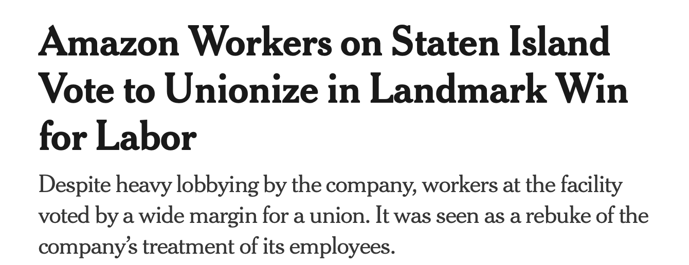

```{r Setup, include = F}
options(htmltools.dir.version = FALSE)
library(pacman)
p_load(broom, latex2exp, ggplot2, ggthemes, ggforce, viridis, dplyr, magrittr, knitr, parallel, xaringanExtra,
       tidyverse, sjPlot, extrafont, mathjaxr, ggforce, furrr, kable, kableExtra,
       fontawesome, ggthemr, hrbrthemes, janitor, plotly, ggeasy, countdown)


# Knitr options
opts_chunk$set(
  comment = "#>",
  fig.align = "center",
  fig.height = 7,
  fig.width = 10.5,
  warning = F,
  message = F,
  dpi=300
)


theme_ms <- function() {
  theme_minimal(base_family = "IBM Plex Sans") +
    theme(panel.grid.minor = element_blank(),
          plot.background = element_rect(fill = "white", color = NA),
          plot.title = element_text(face = "bold"),
          strip.text = element_text(face = "bold"),
          strip.background = element_rect(fill = "grey80", color = NA),
          #axis.title.x = element_text(hjust = 0),
          #axis.title.y = element_text(hjust = 1),
          legend.title = element_text(face = "bold"))
}

theme_set(theme_ms())


```

```{R, colors, include = F}
# Define pink color
red_pink <- "#e64173"
turquoise <- "#20B2AA"
orange <- "#FFA500"
red <- "#E02C05"
blue <- "#2b59c3"
green <- "#0FDA6D"
grey_light <- "grey70"
grey_mid <- "grey50"
grey_dark <- "grey20"
purple <- "#6A5ACD"
met_slate <- "#23373b" 
```


```{r, echo=FALSE}
#knitr::read_chunk('correlations-extended.R')

```


class: middle, center, inverse


.b[Marcio Santetti, Ph.D.]

<br>

.b[Economics Department]

.b[Skidmore College]


[`r fontawesome::fa("envelope")` msantetti@skidmore.edu](msantetti@skidmore.edu) <br>
[`r fontawesome::fa("link")` marcio.rbind.io](https://marcio.rbind.io) <br>
[`r fontawesome::fa("github")` github.com/marciosantetti](https://github.com/marciosantetti) 

---
class: inverse, middle

# Prologue


---

# Prologue

<br>

The .hi[most important] answer in Economics:


<br>

--

> *"It depends."*

---

# Prologue

*Inflation* is a .hi[sustained rise] in the general price level of an economy.

--

The *inflation rate* is the .hi[rate] at which the price level increases.

--

```{r, message=FALSE, dev = "svg", warning=FALSE, fig.height=4.5, echo=FALSE}

cpi <- read_csv("cpi.csv") |> 
  clean_names()

cpi |> 
  ggplot(aes(x = date, y = cpiaucsl_pc1)) + 
  geom_line(linewidth = 0.5, color = "#6f80a1") +
  geom_hline(yintercept = 0, linetype = 2) +
  scale_y_continuous(labels = scales::percent_format(scale = 1)) +
  scale_x_date(date_breaks = "10 years", date_labels = "%b %Y") +
  labs(title = "U.S. CPI inflation rate",
       subtitle = "Jan 1948 – Dec 2023",
       y = "Change from a year ago",
       x = "",
       caption = "Source: U.S. Bureau of Labor Statistics.")

```

---

# Prologue


```{r, message=FALSE, dev = "svg", warning=FALSE, fig.height=5.5, echo=FALSE}


cpi |> 
  filter(date >= "2007-01-01") |> 
  ggplot(aes(x = date, y = cpiaucsl_pc1)) + 
  geom_line(linewidth = 0.5, color = "#6f80a1") +
  geom_hline(yintercept = 0, linetype = 2) +
  scale_y_continuous(labels = scales::percent_format(scale = 1)) +
  scale_x_date(date_breaks = "2 years", date_labels = "%b %Y") +
  labs(title = "U.S. CPI inflation rate",
       subtitle = "Jan 2007 – Dec 2023",
       y = "Change from a year ago",
       x = "",
       caption = "Source: U.S. Bureau of Labor Statistics.")

```

---

# Prologue

<br>

.pull-left[

.hi[The Micro]

- Loss in .hi-red[purchasing power];

- *Unpredictability.*

- Higher .hi-slate[tolerance].

]

--


.pull-right[

.hi[The Macro]

- *Unprecedented* event;

- .hi-red[Policy] responses.
]

--

<br><br>

.note[Q]: .hi[Where] does it come from and .hi[how] to treat it?


---

# Prologue


<br>

*What .hi-red[factors] have led to the current (COVID-era) .hi[inflationary] scenario?*


<br>


```{r, echo=F}
countdown(minutes = 3, seconds = 0, right = "40%", bottom = "40%")
```


---
class: inverse, middle

# Same problem, different stories

---

# Same problem, different stories

.hi[Three] explanations:

--


.pull-left[

[`James Tobin (NYT, 1974)`](https://www.nytimes.com/1974/09/06/archives/there-are-three-types-of-inflation-we-have-two.html)


]

--

.pull-right[

<br>

.b[1]. .hi-red[Demand-pull];

<br>

.b[2]. .hi[Cost-push];

<br>

.b[3]. .hi-green[Class conflict].
]
---

# Same problem, different stories

.hi[Demand-pull] inflation:

--

<br>

> "*Too much money chasing too few goods*." 

[`Barth & Bennett (1975)`](https://www.jstor.org/stable/1991632?origin=crossref)

--

<br>

- Irresponsible government?

- Full-employment?


---

# Same problem, different stories

```{r, message=FALSE, dev = "svg", warning=FALSE, fig.height=5.5, echo=FALSE}

unrate <- read_csv("unrate.csv") |> 
  clean_names()


unrate |> 
  filter(date > "2020-01-01") |> 
  ggplot(aes(x = date, y = unrate)) +
  geom_line(linewidth = 0.5, color = "#33725f") +
  #geom_point(color = blue) +
  scale_x_date(date_breaks = "1 years", date_labels = "%b %Y") +
  scale_y_continuous(breaks = seq(0, 15, 1)) +
  labs(title = "U.S. Civilian unemployment rate",
       subtitle = "Jan 2020 – Dec 2023",
       y = "Percent",
       x = "",
       caption = "Source: U.S. Bureau of Labor Statistics.")


```

---

# Same problem, different stories

.center[


]


---

# Same problem, different stories


.hi-red[Cost-push] inflation:

--

<br>

- Increases in .hi[cost] of production:

  - Wages;
  - Raw materials;
  - Energy.


---

# Same problem, different stories

.pull-left[


]


.pull-right[

<br><br>


<br>

[`El Pais (2023)`](https://english.elpais.com/culture/2023-04-05/how-adeles-30-upended-the-vinyl-industry-and-caused-prices-to-spike.html)
]


---

# Same problem, different stories

.hi[Greedy] corporations?

--

.center[


]

Source: [`Economic Policy Institute (2021)`](https://www.epi.org/blog/corporate-profits-have-contributed-disproportionately-to-inflation-how-should-policymakers-respond/)


---

# Same problem, different stories

.hi[Greedy] corporations?

--

  - A .hi-red[causality issue].

---

# Same problem, different stories

.hi-green[Conflict] inflation:

--

<br>

- .hi-red[Claims] over income distribution;

- Who's to .hi[blame]?

---

# Same problem, different stories


.pull-left[


[`NYT (2022)`](https://www.nytimes.com/2022/04/08/business/economy/starbucks-union-new-york-vote.html)

]

.pull-right[


<br>

[`NYT (2022)`](https://www.nytimes.com/2022/04/01/technology/amazon-union-staten-island.html)

]


---

# Same problem, different stories

.pull-left[

]

--

.pull-right[
- How would you .hi-red[connect] this episode with .hi[conflict inflation]?

```{r, echo=F}
countdown(minutes = 4, seconds = 0, bottom = "30%")
```

]

---
class: inverse, middle

# Treating the patient


---

# Treating the patient

```{r, message=FALSE, dev = "svg", warning=FALSE, fig.height=5.5, echo=FALSE}

unrate <- read_csv("unrate.csv") |> 
  clean_names()


uu <- unrate |> 
  ggplot(aes(x = date, y = unrate)) +
  geom_line(linewidth = 0.5, color = "#33725f") +
  #geom_point(color = blue) +
  scale_x_date(date_breaks = "10 years", date_labels = "%b %Y") +
  scale_y_continuous(breaks = seq(0, 15, 2.5)) +
  labs(title = "U.S. Civilian unemployment rate",
       subtitle = "Jan 1948 – Dec 2023",
       y = "Percent",
       x = "",
       caption = "Source: U.S. Bureau of Labor Statistics.")

uu


```


---

# Treating the patient


```{r, message=FALSE, dev = "svg", warning=FALSE, fig.height=5.75, echo=FALSE}

gi <- read_csv("g-and-i.csv") |> 
  clean_names()


cols <- c("Government expenditures" = "#d87979", "Investment" = "#39384d")


gi |> 
  rename(i = a006re1q156nbea,
         g = a822re1q156nbea) |> 
  ggplot(aes(x = date, y = i, color = "Investment")) +
  geom_line() +
  scale_x_date(date_breaks = "10 years", date_labels = "%Y") +
  geom_line(aes(y = g, color = "Government expenditures")) +
  scale_color_manual(values = cols) +
  easy_add_legend_title("Measure") +
  easy_move_legend(to = "bottom") +
  labs(x = "",
       y = "Government and Investment",
       title = "Government expenditures and Investment",
       subtitle = "Shares of U.S. GDP: 1947–2023",
       caption = "Source: U.S. Bureau of Economic Analysis.")

```

---

# Treating the patient


```{r, message=FALSE, dev = "svg", warning=FALSE, fig.height=5.75, echo=FALSE}
ff <- read_csv("fedfunds.csv") |> 
  clean_names()

ff |> 
  ggplot(aes(x = date, y = fedfunds)) +
  geom_line(linewidth = 0.5, color = "#006666") +
  scale_y_continuous(labels = scales::percent_format(scale = 1),
                     breaks = seq(0, 20, 2.5)) +
  scale_x_date(date_breaks = "8 years", date_labels = "%Y") +
  labs(x = "",
       y = "",
       title = "U.S. federal funds rate",
       subtitle = "1954–2023",
       caption = "Source: U.S. Federal Reserve System.")
```

---

# Treating the patient

<br>

.pull-left[

[`March 2022 FED meeting statement`](https://www.federalreserve.gov/monetarypolicy/files/monetary20220316a1.pdf)


<br>

[`September 2022 FED meeting statement`](https://www.federalreserve.gov/monetarypolicy/files/monetary20220921a1.pdf)


<br>

[`July 2023 FED meeting statement`](https://www.federalreserve.gov/monetarypolicy/files/monetary20230726a1.pdf)
]


--

.pull-right[
- In your view, what are the .hi[cause(s)] of inflation expressed by the US Central Bank?

```{r, echo=F}
countdown(minutes = 2, seconds = 0, bottom = "30%")
```

]


---
class: inverse, middle

# Overdose?


---

# Overdose?

Are we at .hi-red[full employment]?


```{r, message=FALSE, dev = "svg", warning=FALSE, fig.height=5, echo=FALSE}
unrate |> 
  mutate(emp = 100 - unrate) |> 
  filter(date >= "2007-01-01") |> 
  ggplot(aes(x = date, y = emp)) +
  geom_line(linewidth = 0.5) +
  scale_x_date(date_breaks = "2 years", date_labels = "%Y") +
  labs(title = "U.S. recent employment recoveries",
       x = "",
       y = "Employment rate (%)",
       caption = "Source: U.S. Bureau of Labor Statistics.")
```


---

# Overdose?

Are we at .hi-red[full employment]?

```{r, message=FALSE, dev = "svg", warning=FALSE, fig.height=5, echo=FALSE}

emratio <- read_csv("emratio.csv") |> 
  clean_names()

emratio |> 
  ggplot(aes(x = date, y = emratio)) + 
  geom_line(linewidth = 0.5, color = "#6f80a1") +
  scale_x_date(date_breaks = "10 years", date_labels = "%b %Y") +
  scale_y_continuous(breaks = seq(50, 65, 2.5)) +
  labs(title = "U.S. employment-to-population ratio",
       subtitle = "Jan 1948 – Dec 2023",
       y = "Percent",
       x = "",
       caption = "Source: U.S. Bureau of Labor Statistics.")


```


---

# Overdose?

Are we at .hi-red[full employment]?

```{r, message=FALSE, dev = "svg", warning=FALSE, fig.height=5, echo=FALSE}

tcu <- read_csv("tcu.csv")


tcu <- tcu |> 
  clean_names()

tcu |> ggplot(aes(x = date, y = tcu)) +
  geom_line(linewidth = 0.5, color = grey_dark) +
  #geom_point(color = blue) +
  scale_x_date(date_breaks = "10 years", date_labels = "%Y") +
  labs(title = "U.S. Capacity utilization: Total index",
       subtitle = "Jan 1967 – Dec 2023",
       y = "% of capacity",
       x = "",
       caption = "Source: U.S. Federal Reserve System.")

```


---

# Overdose?

What about .hi[conflict]?

> "*The United States Inflation of 1973/74 is a complex and difficult case, unique in our history. In general we may distinguish .b[three] types of inflation: .hi-red[(a)] .b[excess demand] inflation, popularly summarized as “too much money chasing too few goods,” .hi-red[(b)] the .b[price‐wage] spiral, and .hi-red[(c)] .b[shortages and price increases] in important commodities. Our current inflation is a combination of (b) and (c). But public discussion generally ignores these distinctions and identifies every inflation, including the present case, as the classical type (a). From this diagnosis, mistaken in my opinion, follows the classical remedy, the 'old‐time religion' of restricting aggregate demand by tight monetary policy and by fiscal austerity.*"

<br>

[`James Tobin (NYT, 1974)`](https://www.nytimes.com/1974/09/06/archives/there-are-three-types-of-inflation-we-have-two.html)


---

# Overdose?

What about .hi[conflict]?


```{r, message=FALSE, dev = "svg", warning=FALSE, fig.height=5, echo=FALSE}

stp <- read_csv("stoppages.csv")


stp |> 
  ggplot(aes(x = year, y = stoppages)) +
  geom_line(linewidth = 0.7, color = blue) +
  geom_point(color = blue) +
  scale_x_continuous(breaks = c(1950, 1960, 1970, 1980, 1990, 2000, 2010, 2020)) +
  labs(title = "Work stoppages with at least 1,000 workers: 1947–2022",
       y = "# Stoppages",
       x = "",
       caption = "Source: U.S. Bureau of Labor Statistics.")

```


---

# Overdose?

<br>

.pull-left[.hi[Monetary contraction]

- *Overkill*;

- *Double burden* on workers;

- Rise in *inequality*]


--

.pull-right[.hi-red[Who benefits?]

- *Interest* as .hi-red[cost] and .hi-green[revenue]!
]


---

layout: false
class: inverse, middle

# .b[Thank you!]


---
exclude: true
